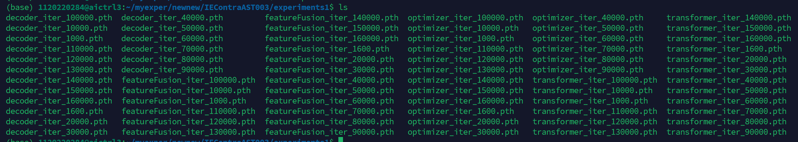

# SRAST-Symmetric-Recovery-for-Arbitrary-Style-Transfer
# 基于对称恢复损失的任意风格迁移​


## 实验设置

我们采用与IECAST相同的实验参数设置，因为新增模块（ACAM和GLFM）并未改变损失函数的结构和目标，而是通过更优的特征对齐和融合机制提升性能。我们采用Adam优化器进行参数更新，学习率为0.0001，批量大小为12，进行160000次迭代。超参数λ_identity1、λ_identity2、λ_1、λ_2、λ_3、λ_4分别设置为50、1、1、1、5和1。


## 代码使用

模型地址：地址

通过网盘分享的文件：models
链接: https://pan.baidu.com/s/1EnI11SIMW5BQX0aR-wOzWg?pwd=luya 提取码: luya 


训练 train

```bash
python train.py \
--content /mnt/nfs/data/home/1120220284/datasets/train2014 \
--style /mnt/nfs/data/home/1120220284/datasets/train \
```


测试test

```bash
python Eval.py \
--content_dir /mnt/nfs/data/home/1120220284/datasets/train2014 \
--style_dir /mnt/nfs/data/home/1120220284/datasets/train \
```


## ACAM模块

**AdaCovAttM**代码解析

#### **1. forward() 函数的数据流动**

在 `forward()` 函数中，我们从 **内容特征 (`content`)** 和 **风格特征 (`style`)** 出发，经过一系列变换，最终生成风格化特征 `gF`。

---

#### **2. 计算 `F`, `G`, `H`**

```python
F = self.f(content_key)
G = self.g(style_key)
H = self.h(style)
```

##### **解释**

- `F = self.f(content_key)`:
  通过 **1×1 卷积** **降低通道数**，减少计算开销，并确保后续计算注意力时通道数匹配。
- `G = self.g(style_key)`:
  通过 **1×1 卷积** 对风格特征 `style_key` 降维，保证通道数与 `F` 一致。
- `H = self.h(style)`:
  通过 **1×1 卷积** 计算风格图像的 `value`，用于后续加权求和。

##### **目的**

- **减少计算量**，避免高通道数导致计算复杂度过高。
- **确保 `F` 和 `G` 形状匹配**，可以计算相似性矩阵 `T`。

------

#### **3. 计算相似性矩阵 `T`**

```
b, _, h_g, w_g = G.size()
G = G.view(b, -1, w_g * h_g).contiguous()

b, _, h, w = F.size()
F = F.view(b, -1, w * h).permute(0, 2, 1)

T = torch.bmm(F, G)
S = self.sm(T)
```

##### **解释**

1. **将 `G` 展平**:
   `G` 形状从 `(B, C, Hs, Ws)` → `(B, C, Hs*Ws)`，用于后续矩阵乘法。
2. **将 `F` 展平并转置**:
   `F` 形状从 `(B, C, Hc, Wc)` → `(B, Hc*Wc, C)`，确保 `F @ G` 形状匹配。
3. **计算 `T = torch.bmm(F, G)`**:
   `T` 形状 `(B, Hc*Wc, Hs*Ws)`，表示 **内容图和风格图键之间的相似性**。
4. **归一化 `T`**:
   `S = self.sm(T)` 进行 `Softmax` 归一化，使 `S` 变成注意力权重。

##### **目的**

- `T` **衡量内容图和风格图的相似度**，用于后续加权求和。
- `S` 作为 **注意力矩阵**，决定内容图如何匹配风格图的特征。

------

#### **4. 计算加权风格特征 `mean`**

```
b, style_c, style_h, style_w = H.size()
H = torch.nn.functional.interpolate(H, (h_g, w_g), mode='bicubic')
style_flat = H.view(b, -1, h_g * w_g).transpose(1, 2).contiguous()

mean = torch.bmm(S, style_flat)
mean = mean.view(b, h, w, -1).permute(0, 3, 1, 2).contiguous()
```

##### **解释**

1. **调整 `H` 的尺寸**:
   - `H` 形状 `(B, C, Hs, Ws)` → `(B, C, Hg, Wg)`（插值匹配 `G` 的尺寸）
2. **展平 `H` 并转置**:
   - `H` 形状 `(B, C, Hg, Wg)` → `(B, Hg*Wg, C)`，以便与 `S` 相乘。
3. **加权求和**:
   - `mean = torch.bmm(S, style_flat)` 计算 **加权风格特征**，形状 `(B, Hc*Wc, C)`。
4. **恢复空间维度**:
   - `mean` 形状 `(B, C, Hc, Wc)`，表示内容特征经过风格变换后的样子。

##### **目的**

- `mean` 代表 **基于注意力加权的风格特征**，用于融合到最终输出中。
- 降维减少计算量，避免计算不稳定，
- `512` 维的协方差矩阵捕捉的特征可能 **包含过多无关信息**，`32` 维已经足够表达风格特征，同时计算更高效

------

#### **5. 计算 `cF` 和 `sF`**

```
cF_nor = nor_mean_std(content)
sF_nor, smean = nor_mean(style)
cF = self.cnet(cF_nor)
sF = self.snet(sF_nor)
```

##### **解释**

- `cF_nor = nor_mean_std(content)`:
  归一化内容特征，确保数值稳定。

- `sF_nor, smean = nor_mean(style)`:
  归一化风格特征，并提取均值信息。

- `cF = self.cnet(cF_nor)`:
  通过 **小型 CNN** 提取低维内容特征，形状 `(512, 32, Hc, Wc)`。

- `sF = self.snet(sF_nor)`:
  通过 **小型 CNN** 提取低维风格特征，形状 `(512, 32, Hs, Ws)`。

- `self.cnet` 用 **1×1 卷积** 进行降维，主要用于 **压缩通道数**，保留内容结构信息。

  `self.snet` 用 **3×3 卷积** 进行降维，能提取局部纹理信息，使 `sF` 保留更多风格特征。

##### **目的**

- `cF` 和 `sF` 用于计算协方差，确保风格迁移时不仅匹配均值，还匹配**特征分布**。

------

#### **6. 计算 `sF` 的协方差，并变换 `cF`**

```
b, c, w, h = cF.size()
s_cov = calc_cov(sF)

gF = torch.bmm(s_cov, cF.flatten(2, 3)).view(b, c, w, h)
gF = self.uncompress(gF)
```

##### **解释**

1. **计算 `sF` 的协方差**:
   - `s_cov = calc_cov(sF)` 计算风格特征 `sF` 的协方差 `(B, 32, 32)`。
2. **变换 `cF`**:
   - `cF` 形状 `(B, 32, Hc, Wc)` → `(B, 32, Hc*Wc)`（展平）
   - `gF = torch.bmm(s_cov, cF)` 计算新的风格化特征。
   - `gF` 形状 `(B, 32, Hc, Wc)`，变回 4D。
3. **恢复通道维度**:
   - `gF = self.uncompress(gF)` 使用 `1×1` 卷积将低维 `(32)` 还原到高维 `(512)`。

##### **目的**

- `s_cov` 确保风格化后的 `cF` **不仅匹配均值，还匹配特征分布**。
- `uncompress` 还原原始高维信息，得到最终风格化特征。

------

#### **7. 最终融合风格信息**

```
gF = gF + mean
return gF, T
```

##### **解释**

- `gF` 经过风格变换，匹配风格图的统计分布。
- `mean` 通过注意力机制获得风格特征。
- `gF = gF + mean` 进行最终融合。

##### **目的**

- `gF` 是最终风格化后的内容图特征，能够同时匹配风格图的 **特征分布** 和 **局部纹理**。


## GLFM模块

FeatureFusion模块

### **1. 初始化部分解析**

#### **1.1 特征投影层 (`proj1-proj3`)**


```python
self.proj1 = nn.Conv2d(2*channels, channels, (1,1))  # 双特征压缩
self.proj2 = nn.Conv2d(channels, channels, (1,1))   # 全局特征精炼
self.proj3 = nn.Conv2d(channels, channels, (1,1))   # 局部特征精炼
```

- 风格迁移作用：
  - `proj1`：将全局风格特征（如AdaIN输出的整体纹理）和局部内容特征（如CNN细节）压缩到同一空间，避免维度爆炸。
  - `proj2/proj3`：分别优化全局和局部特征的表达能力，确保后续融合时两者语义对齐（例如保持笔触风格与内容边缘的一致性）。

#### **1.2 多尺度融合权重生成 (`fuse1x/fuse3x/fuse5x`)**


```python
self.fuse1x = nn.Conv2d(channels, 1, (1,1))  # 点级融合
self.fuse3x = nn.Conv2d(channels, 1, (3,3))  # 局部区域融合
self.fuse5x = nn.Conv2d(channels, 1, (5,5))  # 大范围融合
```

- 风格迁移作用：
  - 不同卷积核捕捉不同范围的风格-内容关联：
    - `1x1`：关注像素级颜色/纹理匹配（如点彩派风格）。
    - `3x3/5x5`：捕捉笔触走向或区域风格模式（如梵高画风的漩涡纹理）。
  - 多尺度融合可避免单一尺度导致的风格失真（例如过度平滑或边缘伪影）。

#### **1.3 反射填充 (`pad3x/pad5x`)**


```python
self.pad3x = nn.ReflectionPad2d((1,1,1,1))  # 3x3卷积填充
self.pad5x = nn.ReflectionPad2d((2,2,2,2))  # 5x5卷积填充
```

- 风格迁移作用：
  - 保持特征图空间尺寸不变，确保风格纹理在图像边缘的连续性（避免边界处出现不自然的截断纹理）。

------

### **2. 前向传播解析**

#### **2.1 特征拼接与压缩**


```python
Fcat = self.proj1(torch.cat((global_feature, local_feature), dim=1))
```

- 风格迁移作用：
  - 将全局风格统计量（如Gram矩阵生成的纹理）与局部内容细节（如物体边缘）融合，为后续权重生成提供联合表征。
  - 例如：在人脸风格化中，全局特征控制肤色，局部特征保留五官结构。

#### **2.2 多尺度融合权重计算**


```python
fusion1 = self.sigmoid(self.fuse1x(Fcat))
fusion3 = self.sigmoid(self.fuse3x(self.pad3x(Fcat)))
fusion5 = self.sigmoid(self.fuse5x(self.pad5x(Fcat)))
fusion = (fusion1 + fusion3 + fusion5) / 3
```

- 风格迁移作用：
  - **1x1权重**：决定哪些像素完全采用全局风格（如大面积色块）。
  - **3x3/5x5权重**：控制风格与内容在区域级别的混合程度（例如保持眼睛轮廓但应用风格化虹膜）。
  - **平均操作**：平衡不同尺度的贡献，防止某一尺度主导导致 artifacts（如5x5可能过度模糊细节）。

#### **2.3 特征融合输出**

```python
return fusion * global_feature + (1 - fusion) * local_feature
```

- 风格迁移作用：
  - 动态加权融合：
    - 高融合值区域（`fusion ≈ 1`）：强风格化（如背景云层的印象派笔触）。
    - 低融合值区域（`fusion ≈ 0`）：保留内容结构（如人脸关键点）。
  - 例如：在风景照片风格化中，天空区域可能更依赖全局风格，而树木枝干则保留更多局部细节。


## AdaIN模块

`AdaIN` 类实现了自适应实例归一化（Adaptive Instance Normalization），这是风格迁移任务中的一种常见方法。以下是代码的逐步解析：

```
class AdaIN(nn.Module):
    def __init__(self):
        super(AdaIN, self).__init__()
```

### 第一步：类初始化

- **目的**：初始化 `AdaIN` 类，使其作为 `nn.Module` 的子类。
- **功能**：`__init__` 方法设置了类的基本结构，使其可以作为神经网络模块使用。

```
def forward(self, content, style, style_strength=1.0, eps=1e-5):
```

### 第二步：前向传播方法定义

- **目的**：定义网络的前向传播过程，处理内容和风格图像。
- 参数：
  - `content`：输入的内容图像。
  - `style`：输入的风格图像。
  - `style_strength`：控制内容与风格的混合程度。
  - `eps`：防止除零的小值。

```
b, c, h, w = content.size()
```

### 第三步：提取图像维度

- **目的**：获取内容图像的维度信息。
- **功能**：`b` 是批大小，`c` 是通道数，`h` 是高度，`w` 是宽度。这些信息在后续处理中特别重要。

```
content_std, content_mean = torch.std_mean(content.view(b, c, -1), dim=2, keepdim=True)
style_std, style_mean = torch.std_mean(style.view(b, c, -1), dim=2, keepdim=True)
```

### 第四步：计算统计量

- **目的**：计算内容和风格图像的均值和标准差。
- 功能：
  - `content.view(b, c, -1)`：将内容张量重塑，便于在空间维度上计算统计量。
  - `torch.std_mean(...)`：计算每个通道的标准差和均值。
- **在风格迁移中的重要性**：这些统计量对于归一化内容图像并根据风格图像进行转换至关重要。

```
normalized_content = (content.view(b, c, -1) - content_mean) / (content_std + eps)
```

### 第五步：归一化内容

- **目的**：使用内容图像的均值和标准差对其进行归一化。
- **功能**：通过减去均值并除以标准差（加上 `eps` 以防止除零）来进行归一化。
- **在风格迁移中的角色**：确保内容特征被中心化和缩放，使其能够与风格特征兼容。

```
stylized_content = (normalized_content * style_std) + style_mean
```

### 第六步：应用风格统计量

- **目的**：根据风格图像的统计特征调整归一化后的内容。
- **功能**：用风格的标准差缩放归一化后的内容，并加上风格的均值。
- **对风格迁移的影响**：这个过程有效地“风格化”了内容，使其具有风格图像的纹理和颜色特征。

```
output = (1 - style_strength) * content + style_strength * stylized_content.view(b, c, h, w)
```

### 第七步：混合内容和风格

- **目的**：根据指定的风格强度将原始内容图像与风格化内容混合。
- **功能**：使用加权和将两者结合。如果 `style_strength` 为 0，输出为纯内容图像；如果为 1，则为纯风格化内容。
- **在风格迁移中的意义**：这种混合允许内容与风格之间的渐进过渡，提供了对风格应用程度的灵活控制。

```
return output
```

### 第八步：返回结果

- **目的**：输出最终的风格化图像。
- **在风格迁移中的角色**：该图像可以用于可视化或进一步处理，完成风格迁移操作。


## 对称损失框架

forward函数


#### **第一次正向风格迁移**

```python
def forward(self, content, style):
    # 特征提取
    style_feats = self.encoder(style)  # 风格图像特征 [relu3_1, relu4_1]
    content_feats = self.encoder(content)  # 内容图像特征
    
    # 第一次风格迁移 (Ic → Ics)
    local_feat, *_ = self.transformer(
        content_feats[3], style_feats[3],  # relu3_1层特征
        content_feats[4], style_feats[4]   # relu4_1层特征
    )
    global_feat = self.adain(content_feats[3], style_feats[3])
    stylized1 = self.featureFusion(local_feat, global_feat)
    output1 = self.decoder(stylized1)  # 生成第一次风格化结果 Ics
```


#### **第一次恢复操作**

```python
    # 内容恢复路径 (Ics → Ic')
    opt1_feats = self.encoder(output1)
    rc1_local, *_ = self.transformer(
        opt1_feats[3], content_feats[3],  # 用原始内容作为风格
        opt1_feats[4], content_feats[4]
    )
    rc1_global = self.adain(opt1_feats[3], content_feats[3])
    stylized_rc1 = self.featureFusion(rc1_local, rc1_global)
    rc1 = self.decoder(stylized_rc1)  # 恢复的内容图像 Ic'

    # 风格恢复路径 (Ics → Is')
    rs1_local, *_ = self.transformer(
        style_feats[3], opt1_feats[3],  # 用原始风格作为内容
        style_feats[4], opt1_feats[4]
    )
    rs1_global = self.adain(style_feats[3], opt1_feats[3])
    stylized_rs1 = self.featureFusion(rs1_local, rs1_global)
    rs1 = self.decoder(stylized_rs1)  # 恢复的风格图像 Is'
```

#### **第二次正向迁移（对称路径）**

```python
    # 第二次风格迁移 (Is → Isc)
    stylized2, *_ = self.transformer(
        style_feats[3], content_feats[3],  # 输入顺序交换
        style_feats[4], content_feats[4]
    )
    global2 = self.adain(style_feats[3], content_feats[3])
    output2 = self.decoder(self.featureFusion(stylized2, global2))  # Isc
```

#### **第二次恢复操作**

```python
    # 内容恢复路径 (Isc → Ic'')
    opt2_feats = self.encoder(output2)
    rc2_local, *_ = self.transformer(
        content_feats[3], opt2_feats[3],  # 反向恢复
        content_feats[4], opt2_feats[4]
    )
    rc2_global = self.adain(content_feats[3], opt2_feats[3])
    rc2 = self.decoder(self.featureFusion(rc2_local, rc2_global))

    # 风格恢复路径 (Isc → Is'')
    rs2_local, *_ = self.transformer(
        opt2_feats[3], style_feats[3],
        opt2_feats[4], style_feats[4]
    )
    rs2_global = self.adain(opt2_feats[3], style_feats[3])
    rs2 = self.decoder(self.featureFusion(rs2_local, rs2_global))
```


### **关键设计**

迭代恢复流程：
1. 正向路径：Ic → Ics → [Ic' , Is']
   - 通过Ics恢复原始内容(Ic')和风格(Is')
2. 对称路径：Is → Isc → [Ic'' , Is'']
   - 通过Isc反向验证恢复能力


# QS


## eg1. 图像风格迁移的实验设置？

在实验设置中，考虑到图像风格迁移任务的特殊性（目标风格多样、生成结果主观性强），目前领域内尚未形成统一的黄金测试集。为遵循通用评估流程并保证结果可比性，我们采用与经典文献一致的策略：内容图像选自MS-COCO测试集（涵盖复杂自然场景），风格图像选自WikiArt测试数据集（包含油画、水彩、素描等多元艺术风格）。具体而言，随机抽取40张内容图像与50张风格图像进行全组合配对，共生成2000张风格化样本。


我们选取了10种主流的风格迁移方法

1. [Arbitrary style transfer in real-time with adaptive instance normalization[C]//Proceedings of the IEEE international conference on computer vision. 2017](https://openaccess.thecvf.com/content_ICCV_2017/papers/Huang_Arbitrary_Style_Transfer_ICCV_2017_paper.pdf)

   + Quantitative evaluations. Does our algorithm trade off some quality for higher speed and flexibility, and if so by how much? To answer this question quantitatively, we compare our approach with the optimization-based method [16] and the fast single-style transfer method [52] in terms of the content and style loss. Because our method uses a style loss based on IN statistics, we also modify the loss function in [16] and [52] accordingly for a fair comparison (their results in Fig. 4 are still obtained with the default Gram matrix loss). The content loss shown here is the same as in [52, 16]. **The numbers reported are averaged over 10 style images and 50 content images randomly chosen from the test set of the WikiArt dataset [39] and MS-COCO [36]**.
   + **报告的数字是从 WikiArt 数据集 [39] 和 MS-COCO [36] 的测试集中随机选择的 10 个样式图像和 50 个内容图像的平均值。**

2. [Artflow: Unbiased image style transfer via reversible neural flows[C]//Proceedings of the IEEE/CVF conference on computer vision and pattern recognition. 2021](https://openaccess.thecvf.com/content/CVPR2021/html/An_ArtFlow_Unbiased_Image_Style_Transfer_via_Reversible_Neural_Flows_CVPR_2021_paper.html)

   + 未提及定量比较时采用的数据来源，但是用户研究有数据图像数量，但是也未提及来源
   + User Study To quantitatively demonstrate that the proposed ArtFlow has the comparable style transfer performance with the state-of-the-art algorithms, we perform a user study. **Our user study is based on the validation dataset that consists of 43 content images and 27 style images.** We obtain the style transfer results of StyleSwap, AdaIN, WCT, LinearWCT, OptimalWCT, Avatar-Net, and the proposed ArtFlow on every content-style pair, respectively. We finally obtain 1161 style transfer results for each method. In user study, we list all style transfer results of a content-style pair and let the user to choose ONE most preferable style transfer result. We eventually collect 799 effective votes. Tab. 2 shows the style transfer results. The proposed ArtFlow obtains more votes compared with other style transfer methods, which demonstrates that our method has comparable style transfer performance with the state-of-the-art methods.
   + 我们的用户研究基于验证数据集，该数据集由 **43 个内容图像和 27 个样式图像**组成。

   + 

3. [Ccpl: Contrastive coherence preserving loss for versatile style transfer[C]//European conference on computer vision. Cham: Springer Nature Switzerland, 2022](https://link.springer.com/chapter/10.1007/978-3-031-19787-1_11)

   + For image style transfer comparison, we randomly choose 10 content images and 10 style images to synthesize 100 stylized images for each method and calculate their mean SIFID as the stylization metric. Besides, we compute the mean LPIPS to measure the visual quality of photo-realistic results.
   + 对于图像风格传递比较，我们随机选取 10 幅内容图像和 10 幅风格图像，每种方法合成 100 幅风格化图像，并计算其**平均 SIFID** 作为风格化度量。此外，我们还计算平均 LPIPS 来测量照片真实感结果的视觉质量。
   + 

4. [Arbitrary video style transfer via multi-channel correlation[C]//Proceedings of the AAAI conference on artificial intelligence. 2021](https://ojs.aaai.org/index.php/AAAI/article/view/16208)

   + 文中未明确提及测试阶段使用的特定数据集。用户研究中有具体的数量
   + User study We conducted user studies to compare the stylization effect of our method with those of the aforementioned SOTA methods. **We selected 20 content images and 20 style images to generate 400 stylized images using different methods.** First, we showed participants a pair of content and style images. Second, we showed them two stylized results generated by our method and a random contrast method. Finally, we asked the participants which stylized result has the best rendered effects by considering the integrity of the content structures and the visibility of the style patterns. We collected 2; 500 votes from 50 participants and present the voting results in Figure 7(a). Overall, our method can achieve the best image stylization effect.
   + **我们选择了 20 个内容图像和 20 个样式图像，使用不同的方法生成了 400 个样式化图像。**

5. [Learning linear transformations for fast image and video style transfer[C]//Proceedings of the IEEE/CVF conference on computer vision and pattern recognition. 2019](https://openaccess.thecvf.com/content_CVPR_2019/html/Li_Learning_Linear_Transformations_for_Fast_Image_and_Video_Style_Transfer_CVPR_2019_paper.html)

   + 文中未明确提及测试阶段使用的特定数据集。用户研究中有具体的数量
   + User study. We conduct a user study to evaluate the proposed algorithm against the state-of-the-art style transfer methods [8, 31, 12, 18]. We use 6 content and 40 style images to synthesize 240 stylized results, and show 15 randomly chosen content and style combinations to each subject. For each combination, we present 5 synthesized images by each method mentioned above in a random order and ask the subject to select the most visually pleasant one. We collect 540 votes from 36 users and present the percentage of votes for each method in Fig. 9(a). Overall, the proposed algorithm is favored among all evaluated methods.
   + 我们使用 **6 个内容和 40 个风格的图像合成了 240 个风格化的结果**，并显示了 15 个随机选择的内容和风格组合对每个主题。

6. [Adaattn: Revisit attention mechanism in arbitrary neural style transfer[C]//Proceedings of the IEEE/CVF international conference on computer vision. 2021](https://openaccess.thecvf.com/content/ICCV2021/papers/Liu_AdaAttN_Revisit_Attention_Mechanism_in_Arbitrary_Neural_Style_Transfer_ICCV_2021_paper.pdf)

   + 文中未明确提及测试阶段使用的特定数据集。用户研究中有具体的数量
   + User Study. Following SANet, **15 content images and 15 style images are randomly picked to form 225 images pairs in total.** Then we randomly sample 20 content-style pairs and synthesize stylized images by different methods. Results are presented side-by-side in a random order and we ask subjects to select their favorite one from three views: content preservation, stylization degree, and overall preference. We collect 2000 votes for each view from 100 users and show the number of votes of each method in the form of bar chart. The results in Figure 6 demonstrate that our stylized results are more appealing than competitors.
   + 继 SANet 之后，**随机抽取 15 个内容图像和 15 个样式图像组成总共 225 个图像对。**

7. [Arbitrary style transfer with style-attentional networks[C]//proceedings of the IEEE/CVF conference on computer vision and pattern recognition. 2019](https://openaccess.thecvf.com/content_CVPR_2019/html/Park_Arbitrary_Style_Transfer_With_Style-Attentional_Networks_CVPR_2019_paper.html)

   + 文中未明确提及测试阶段使用的特定数据集。用户研究中有具体的数量
   + User study. We used 14 content images and 70 style images to synthesize 980 images in total. We randomly selected 30 content and style combinations for each subject and showed them the stylized images obtained by the five comparison methods side-by-side in a random order. We then asked the subject to indicate his/her favorite result for each style. We collect 2,400 votes from 80 users and show the percentage of votes for each method in Fig. 5. The result shows that the stylized results obtained by our method are preferred more often than those of other methods.
   + **我们使用了 14 个内容图像和 70 个风格图像合成了 980 个图像。**

8. [Stytr2: Image style transfer with transformers[C]//Proceedings of the IEEE/CVF conference on computer vision and pattern recognition. 2022](https://openaccess.thecvf.com/content/CVPR2022/html/Deng_StyTr2_Image_Style_Transfer_With_Transformers_CVPR_2022_paper.html)

   + Quantitative evaluation. We calculate the content difference between the generated results and input content images as well as the style difference between the generated results and input style images, as two indirect metrics of the style transfer quality. Intuitively, the smaller the difference the better the input content/style is preserved. We randomly select 40 style images and 20 content images to generate 800 stylized images. For each method, we compute the content difference based on Eq. (9) and calculate the style difference following Eq. (10). Table 2 shows the corresponding quantitative results. Overall, our method achieves the lowest content losses and IEST [9] is the second-best. However, as discussed in the qualitative evaluation above, the style loss of IEST is the highest because the style appearance of generated results is not far from the input style reference.
   + 我们**随机选取 40 个样式图像和 20 个内容图像，生成 800 个样式化图像**。
   + 

9. [Artistic style transfer with internal-external learning and contrastive learning[J]. Advances in Neural Information Processing Systems, 2021](https://proceedings.neurips.cc/paper_files/paper/2021/hash/df5354693177e83e8ba089e94b7b6b55-Abstract.html)、

   + 文中未明确提及测试阶段使用的特定数据集。用户研究中有具体的数量
   + Preference score. We use 10 content images and 15 style images to synthesize 150 stylized images for each method.
   + 我们使用 10 个内容图像和 15 个风格图像合成每种方法的 150 个风格化图像。

10. [Progressive attentional manifold alignment for arbitrary style transfer[C]//Proceedings of the Asian Conference on Computer Vision. 2022](https://openaccess.thecvf.com/content/ACCV2022/papers/Luo_Progressive_Attentional_Manifold_Alignment_for_Arbitrary_Style_Transfer_ACCV_2022_paper.pdf)

    + 文中未明确提及测试阶段使用的特定数据集。用户研究中有具体的数量
    + User Study. As shown in Tab.1 We perform user study on eight arbitrary style transfer methods: AdaIN [13], WCT [22], SANet [29], AdaAttN [25], StyleFormer [38], IEC [2], MAST [14], and the proposed PAMA. In the study, a single sample consists of a content image, a style image, and eight corresponding stylization results generated by the eight methods. We use 25 content images and 25 style images to generate 625 samples and randomly draw 20 samples for each user. For each sample, users are asked to choose the best stylization result according to the evaluation indicators: content quality, style quality, and overall quality. Each user judges the quality according to their subjective perception. We collect 5000 votes from 250 users for each indicator. The results are shown in Table A. The result demonstrates that our method produces results with better style quality and overall performance.
    + 我们使用 25 个内容图像和 25 个样式图像生成 625 个样本


## eg2. 怎么证明是自己训练的？


实验数据集


实验对比10种基线方法


项目图


训练中间过程保存模型

16万次迭代



定量比较实验计算结果


风格化2000张图片


定量评价指标计算


